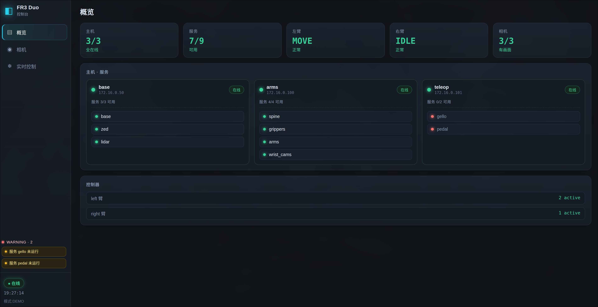
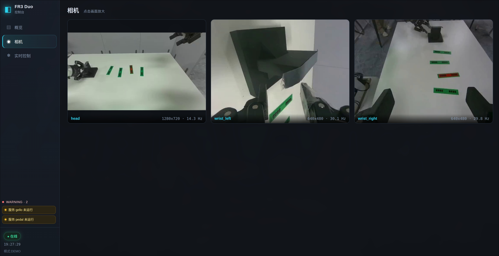
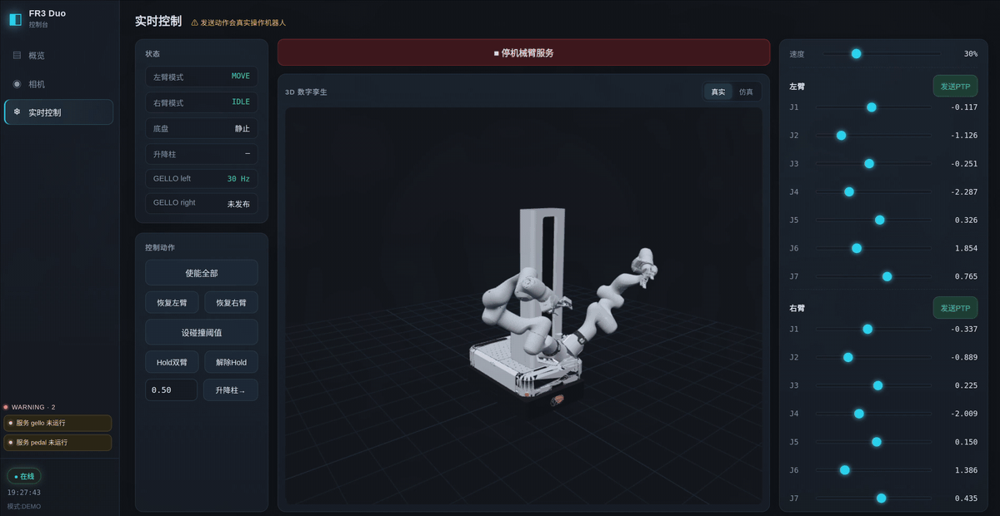
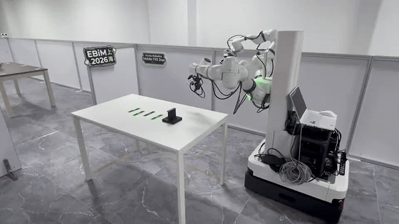
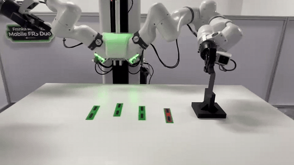
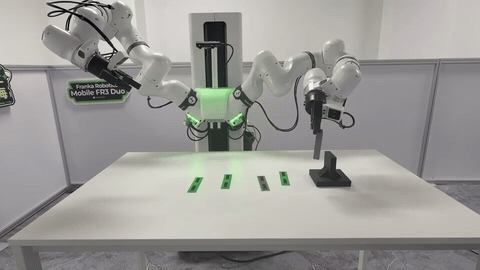
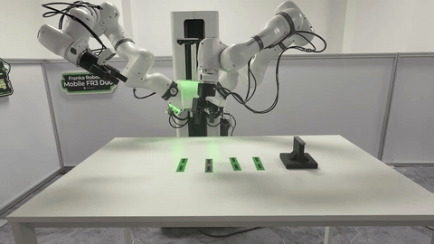
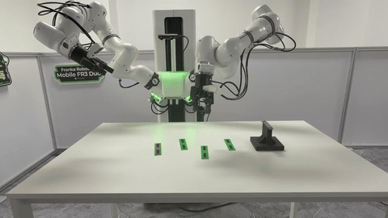

# EBiM Offline Task 2 — Evaluation Guide

> **中文:** see [README_ch.md](README_ch.md) · This is the English version (default).

Real-robot evaluation program for Task 2 (Mobile FR3 Duo, thermal-pad placement). This is
what the operator runs on a robot-side host (the dual-arm host 172.16.0.100, or any host on
the robot LAN).

Model inference runs on a server that the team keeps online; **the operator does not set up or
manage it**. The team provides its address (`SERVER_HOST:SERVER_PORT`) in the issue comments
before evaluation, and the operator passes it via the env vars in §3.

> **Runtime network.** Unlike the usual "no network" assumption, this client **needs outbound
> network** to reach that inference server (the site has confirmed outbound internet). It uses
> no other internet access.

---

## 1. Setup (once, on the robot-side host)

Prerequisites: Docker Engine + SSH keys with passwordless access to the three robot hosts
(172.16.0.50 / .100 / .101; including access to itself when run on .100).

```bash
docker build -t ebim-task2-offline:submission .
docker run --rm ebim-task2-offline:submission health   # expect "health: PASS"
```

## 2. Hardware bring-up

1. Power on the robot and both arm control boxes; **release both E-stops**;
2. Open the left-arm Desk (https://172.16.16.12) and right-arm Desk (https://172.16.16.11):
   unlock joints → **Activate FCI** (each arm once);
3. Bring up and enable all hardware (each service started + enabled with auto-retry; ends with
   a three-camera self-check, "✓✓" means ready):

```bash
docker run --rm -it --network host --ipc host \
  -v $HOME/.ssh:/root/.ssh:ro \
  ebim-task2-offline:submission bringup
```

## 3. Run the evaluation

The base starts at its initial position. There are two inference modes; **the client command
is identical in both — only `SERVER_HOST` differs.**

### 3.1 Remote-server inference (default)

The team keeps an inference server online and posts its address in the issue comments before
evaluation. Launch (includes automatic base approach/docking):

```bash
docker run --rm -it --network host --ipc host \
  -v $HOME/.ssh:/root/.ssh:ro \
  -e ROS_DOMAIN_ID=0 \
  -e SERVER_HOST=<address provided by the team> -e SERVER_PORT=6060 \
  ebim-task2-offline:submission run
```

### 3.2 Local NVIDIA-GPU inference (only if the site provides one)

Requirements: an NVIDIA GPU with ≥12 GB VRAM + NVIDIA Container Toolkit, and the team's
checkpoint (HuggingFace link in the submission's supplementary field; private — access can be
arranged through the organizers) downloaded to a local directory.

```bash
# 1) build the inference-server image (pulls torch cu128 + lerobot, several GB)
docker build -f Dockerfile.server -t ebim-task2-server:submission .

# 2) start the server with the checkpoint mounted read-only
docker run -d --gpus all -p 6060:6060 \
  -v /path/to/checkpoint:/models/ckpt:ro \
  ebim-task2-server:submission
# wait until `docker logs` shows「监听 :6060」(= listening; first load takes 1–4 min)

# 3) run the client — same command as §3.1 with SERVER_HOST=127.0.0.1
docker run --rm -it --network host --ipc host \
  -v $HOME/.ssh:/root/.ssh:ro \
  -e ROS_DOMAIN_ID=0 \
  -e SERVER_HOST=127.0.0.1 -e SERVER_PORT=6060 \
  ebim-task2-offline:submission run
```

### During and after a run (both modes)

Fully automatic: base approaches and docks at the table → arms/spine to start pose → right arm
locked → left arm taken over → policy execution starts automatically, no keypress needed.

Keys available during a run:
| Key | Action |
|---|---|
| `p` | Pause (arm holds; press Enter to resume) |
| `q` | End this round and exit |
| Ctrl-C | Emergency stop (stop commands, release left-arm control, arm brakes in place) |

**End of round**: after placement (gripper stays open ~5s) the program **ends automatically**
and stops sending commands; you may also press `q` to end manually. Then reset the scene
(thermal pad back to start) and begin the next round:
- if the base returned to its initial position: run the `... run` command again;
- if the base did not move (still at the table): change the trailing `run` to `run-docked` in
  the same command to skip the approach and start directly.

## 4. Monitoring UI (optional)

A built-in web console shows, in real time: the three camera streams; online status of the
three hosts and all services; dual-arm controller status; a 3D digital twin with live joint
readouts.

```bash
docker run --rm --network host -v $HOME/.ssh:/root/.ssh:ro \
  ebim-task2-offline:submission viewer
# open http://<robot-host IP>:8090 from any machine on the same network
```

| Overview — hosts / services / arm status | Cameras — three live streams |
|:---:|:---:|
|  |  |

Real-time control page — 3D digital twin + live joint readouts ([on-site video](docs/img/ui_control.mp4)):



## 5. On-site run videos

Recorded during on-site deployment on the real testbed (all muted; GIFs are speed-up previews,
click the link under each for the original-speed video).

**Full run** — base approach, docking, and placement, end to end (10× speed,
[original](docs/img/full_run.mp4)):



**Placement close-ups** — thermal pad placed on each of the four board positions (2× speed):

|  |  |
|:---:|:---:|
| Position 1 · [original](docs/img/target_1.mp4) | Position 2 · [original](docs/img/target_2.mp4) |
|  |  |
| Position 3 · [original](docs/img/target_3.mp4) | Position 4 · [original](docs/img/target_4.mp4) |

## 6. Troubleshooting

In the table, `tmrctl ...` means:

```bash
docker run --rm -it --network host -v $HOME/.ssh:/root/.ssh:ro \
  ebim-task2-offline:submission tmrctl <args>
```

| Symptom | Action |
|---|---|
| Arm red light / locked | `tmrctl --enable left_arm` (or right_arm) |
| Arm unreachable after E-stop | release E-stop → `tmrctl --down ctl --only arms` → `tmrctl --up ctl --only arms` → enable both arms |
| "Connection to FCI refused" | Desk → Take over control → Activate FCI |
| Wheels don't move | `tmrctl --enable base` |
| Gripper doesn't move | `tmrctl --enable grippers` |
| Client can't reach the server | the team confirms the server is online; rerun the eval command (it reconnects automatically on start) |
| Overall robot status | `tmrctl --status` (trust the topic-rate column) |

## 7. Appendix: running without Docker

Prerequisites: passwordless SSH as in §1; install pixi
(`curl -fsSL https://pixi.sh/install.sh | bash`) then `pixi install` at the repo root; Python3
deps `numpy pyyaml`, plus `pip install ruckig` recommended (falls back automatically if absent).
The ROS environment auto-adapts (prefers the host's own `~/tmr_env.sh`, otherwise a distro
under /opt/ros). Set the server address in `deploy/inference/config.yaml` under `server:`.

| Function | Docker subcommand | Bare-metal equivalent |
|---|---|---|
| Hardware bring-up | `bringup` | `bash deploy/prepare/up_and_enable_ctl.sh` |
| Full eval (with base approach) | `run` | `bash deploy/pipeline_full.sh` |
| Eval (base already at table) | `run-docked` | `bash deploy/pipeline.sh` |
| Monitoring UI | `viewer` | `bash viewer-ui/run.sh --bind 0.0.0.0 --port 8090` |
| Robot control / recovery | `tmrctl <args>` | `pixi run tmrctl <args>` |

## 8. Directory

```
Dockerfile / docker/  Client container: entry / health / tool shim
Dockerfile.server / server/  Inference-server container (used only for §3.2 local-GPU mode)
deploy/               Eval entry (pipeline.sh / pipeline_full.sh) and the inference client
prepare/sim2real_cal/ Automatic base approach/docking
controller/           tmrctl: robot service start/enable/discrete control/status monitor
smoother/             Joint rate-limited smoothing (internal)
teleop/               Right-arm hold relay (internal)
viewer-ui/            Three-camera monitoring frontend (optional)
docs/                 Official two-host runtime guide
pixi.toml             Control-tool environment (for the bare-metal path)
```
